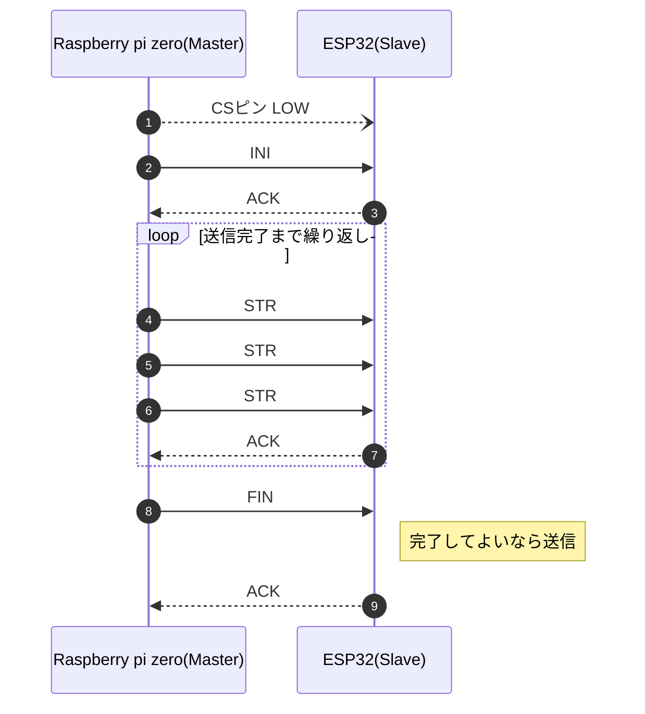
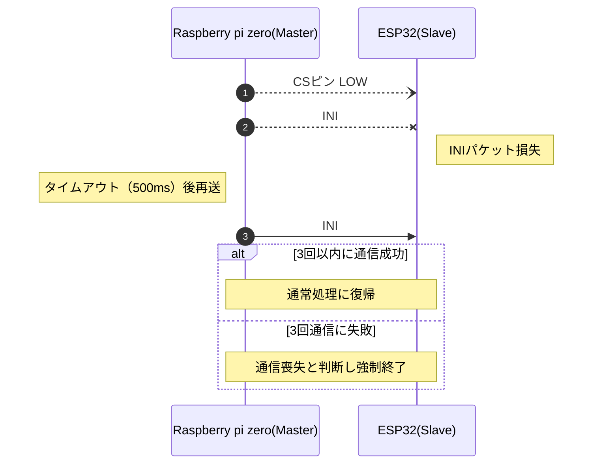
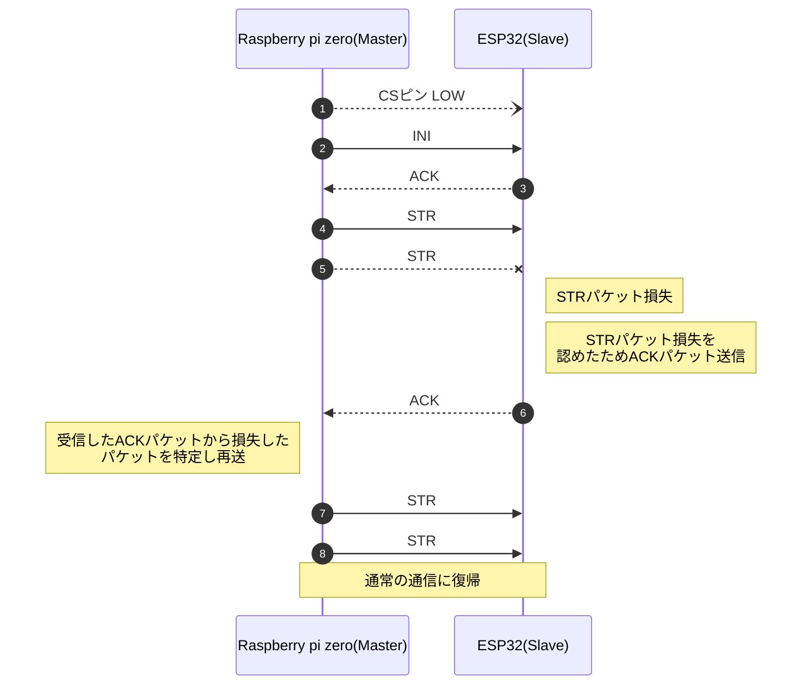
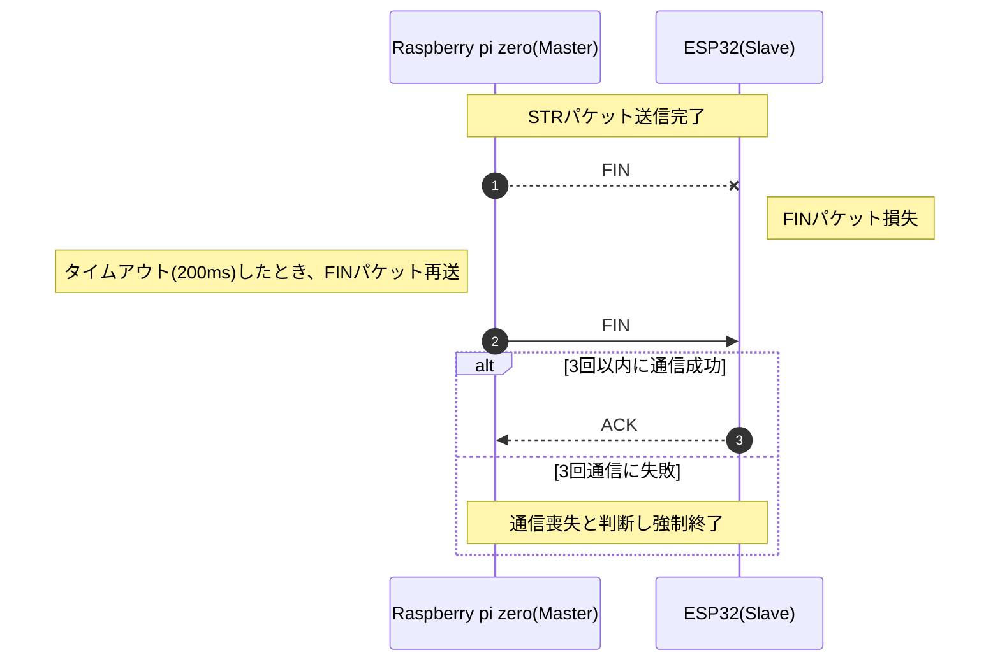
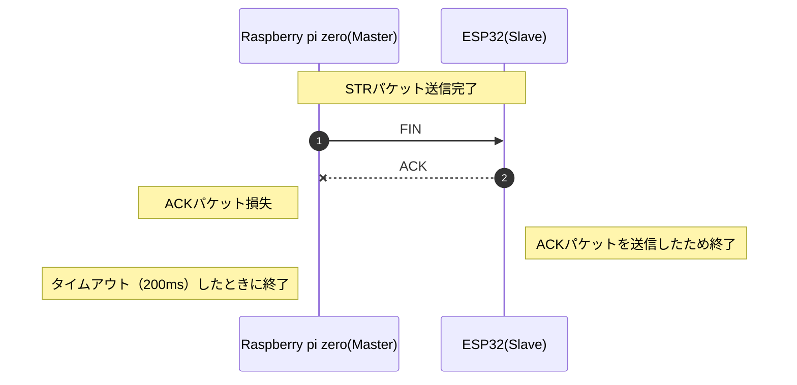

```mermaid
sequenceDiagram
    autonumber
    participant M as Raspberry pi zero(Master)
    participant S as ESP32(Slave)

    M --) S: CSピン LOW
    M ->> S: INI
    S -->> M: ACK
    loop 送信完了まで繰り返し
        M ->> S: STR
        M ->> S: STR
        M ->> S: STR
        S -->> M: ACK
    end
    M ->> S: FIN
    Note right of S: 完了してよいなら送信
    S -->> M: ACK
```
障害パターン  

INI喪失  

```mermaid
sequenceDiagram
    autonumber
    participant M as Raspberry pi zero(Master)
    participant S as ESP32(Slave)

    M --) S: CSピン LOW
    M --X S: INI
    Note right of S: INIパケット損失
    Note left of M: タイムアウト（500ms）後再送
    M ->> S: INI

    alt 3回以内に通信成功
        Note over S, M: 通常処理に復帰
    else 3回通信に失敗
        Note over S, M: 通信喪失と判断し強制終了
    end
```

STR損失

```mermaid
sequenceDiagram
    autonumber
    participant M as Raspberry pi zero(Master)
    participant S as ESP32(Slave)

    M --) S: CSピン LOW
    M ->> S: INI
    S -->> M: ACK
    M ->> S: STR
    M --x S: STR
    Note right of S: STRパケット損失
    Note right of S: STRパケット損失を<br />認めたためACKパケット送信
    S -->> M: ACK
    Note left of M: 受信したACKパケットから損失した<br />パケットを特定し再送
    M ->> S: STR
    M ->> S: STR
    Note over S, M: 通常の通信に復帰
```

FIN損失  

```mermaid
sequenceDiagram
    autonumber
    participant M as Raspberry pi zero(Master)
    participant S as ESP32(Slave)

    Note over S, M: STRパケット送信完了
    M --X S: FIN
    Note right of S: FINパケット損失
    Note left of M: タイムアウト(200ms)したとき、FINパケット再送
    M ->> S: FIN
    alt 3回以内に通信成功
        S -->> M: ACK
    else 3回通信に失敗
        Note over S, M: 通信喪失と判断し強制終了
    end
```

最終ACK損失  

```mermaid
sequenceDiagram
    autonumber
    participant M as Raspberry pi zero(Master)
    participant S as ESP32(Slave)

    Note over S, M: STRパケット送信完了
    M ->> S: FIN
    S --X M: ACK
    Note left of M: ACKパケット損失
    Note right of S: ACKパケットを送信したため終了
    Note left of M: タイムアウト（200ms）したときに終了
```