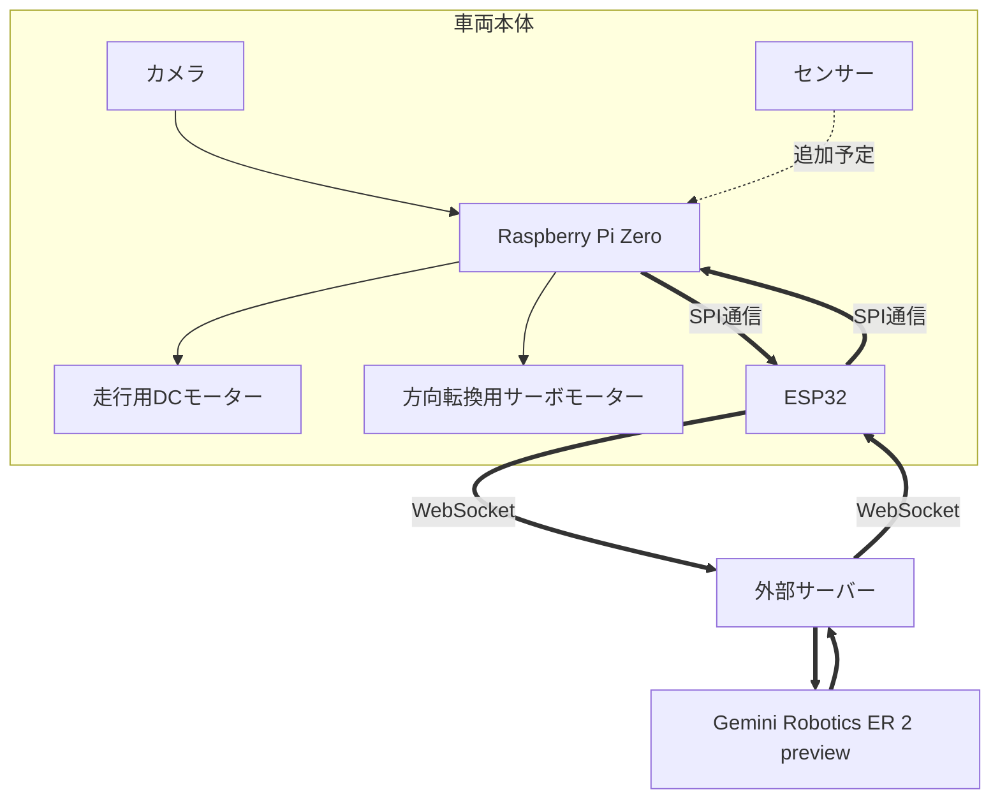

# 🚗 画像解析技術を用いた自律走行車両の開発 (AI Autonomous Car)

最新の視覚言語モデル（VLM: Gemini Robotics等）とエッジデバイス（Raspberry Pi Zero + ESP32）を組み合わせ、カメラ映像から周囲の状況を判断して自律走行を行う車両の開発プロジェクトです。

---

## 📌 システムアーキテクチャ

車両側（エッジ）とクラウド/サーバー側、そして最新のAIモデルが連携して動作します。



---

## ⚙️ 通信プロトコル (Master-Slave SPI)

Raspberry Pi Zero（Master）とESP32（Slave）間では、信頼性の高い独自のSPIパケット通信プロトコル（INI / STR / FIN / ACK およびタイムアウト・再送制御）を採用しています。

- **詳細仕様:** [MSprotocol.md](./MSprotocol.md) 参照

---

## 📁 リポジトリ構成

```text
ai-car/
├── 3d/                  # 車体シャシー、ステアリング、ベアリング等の3D CAD・印刷データ (FreeCAD / 3MF / STL / STEP)
├── programs/            # 制御プログラム
│   ├── esp32/           # ESP32ファームウェア (Arduino IDE用 .ino)
│   ├── raspberry-pi-zero/ # 車載制御スクリプト (Python)
│   └── server/          # サーバー側通信・AI連携スクリプト (Python)
├── receipt/             # 購入レシート等
├── BOM.csv              # 部品表 (Bill of Materials)
├── data-flowchart.md    # システムデータフロー図
└── MSprotocol.md        # Master-Slave通信プロトコル仕様書
```

---

## 🛠️ 主なハードウェア・部品
- **頭脳・制御:** Raspberry Pi Zero, ESP32
- **アクチュエータ:** 走行用DCモーター, ステアリング用サーボモータ
- **AI・認識:** カメラモジュール, VLM (Gemini Robotics)
- **構造:** 3Dプリンタによる自作シャシー・パーツ (`3d/` ディレクトリを参照)

---

## 📜 ライセンス
本リポジトリのソースコードおよび設計データはオープンソースとして公開されています。
