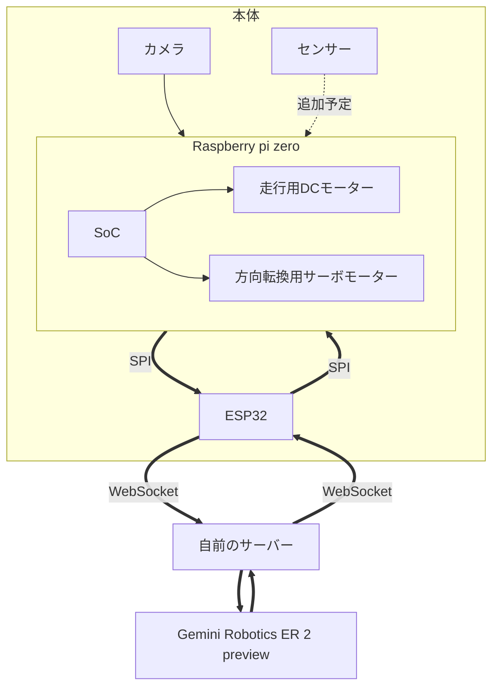

```mermaid
flowchart TD
subgraph machine[本体]
    subgraph rasp[Raspberry pi zero]
        raspsoc[SoC] --> dcmotor[走行用DCモーター]
        raspsoc --> servomotor[方向転換用サーボモーター]
    end
    esp[ESP32]
    cam[カメラ] --> rasp
    sensor[センサー] -.->|追加予定| rasp
end
server[自前のサーバー]
google[Gemini Robotics ER 2 preview]
esp ==>|SPI| rasp
rasp ==>|SPI| esp
esp ==>|WebSocket| server
server ==>|WebSocket| esp
server ==> google
google ==> server
```
